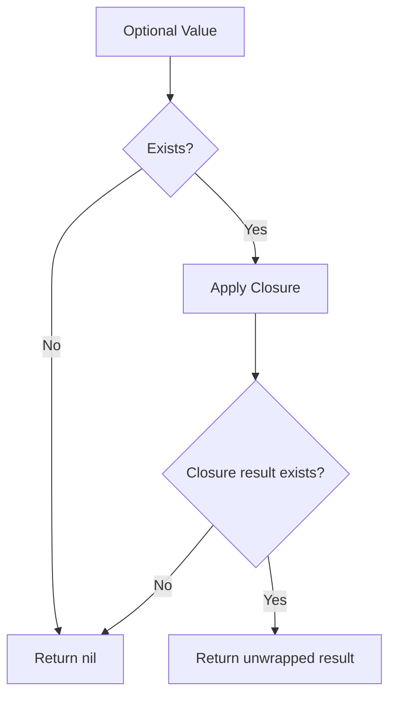

# Optional FlatMap (`.flatMap`)

The `flatMap` method on optionals is used to transform a value when the transformation function itself returns an optional. Its primary purpose is to avoid **Nested Optionals**.

## 1. The Problem: Nested Optionals
If you use `map` with a function that returns an optional, you end up with "double optionals".

```swift
let string: String? = "123"
let mapped = string.map { Int($0) }
// mapped is Int?? (Optional<Optional<Int>>)
```

## 2. The Solution: `flatMap`
`flatMap` "flattens" the result, so you only have a single level of optionality.

```swift
let string: String? = "123"
let flatMapped = string.flatMap { Int($0) }
// flatMapped is Int?
```

## 3. Comparison with Optional Chaining
`flatMap` is very similar to optional chaining (`?.`), but it allows you to pass a closure for custom transformation logic rather than just accessing a property.

```swift
// These two are effectively the same
let title = user.flatMap { $0.job?.title }
let titleChain = user?.job?.title
```

## 4. Chaining Multiple Operations
`flatMap` is excellent for chaining multiple asynchronous or failable operations.

```swift
func findUser(id: Int) -> User? { ... }
func getProfile(user: User) -> Profile? { ... }

let profile = findUser(id: 42).flatMap { getProfile(user: $0) }
```

## 5. Logic Visualization


> [!NOTE]
> `flatMap` is a common pattern in Functional Programming. It is often referred to as "bind". It allows you to transform data that might not exist without constantly checking for `nil`.
