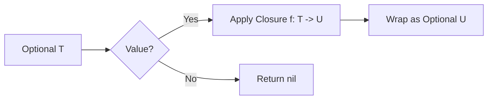

# Optional Map (`.map`)

The `.map` method on optionals is a functional programming pattern that allows you to transform the value inside an optional if it exists, without explicitly unwrapping it first.

## 1. Basic Usage
`map` takes a closure. If the optional has a value, the closure is executed with that value, and the result is wrapped back into a new optional. If the optional is `nil`, `map` simply returns `nil` and the closure is never called.

```swift
let name: String? = "antigravity"
let uppercaseName = name.map { $0.uppercased() }
// uppercaseName is Optional("ANTIGRAVITY")
```

## 2. Type Transformation
The result of the closure can be a different type than the input.

```swift
let input: String? = "5"
let integer = input.map { Int($0) }
// integer is Int?? (Optional<Optional<Int>>) 
```
*Note: If your transformation returns an optional, consider using `flatMap` instead to avoid nested optionals.*

## 3. Benefits
- **Safety**: No risk of forced unwrap crashes.
- **Conciseness**: Avoids `if let` boilerplate.
- **Immutability**: Allows you to perform transformations while keeping the data flow functional.

## 4. Comparison with `if let`
```swift
// Using if let
var result: Int?
if let s = input {
    result = Int(s)
}

// Using map
let resultMapped = input.map { Int($0) }
```

## 5. Logic Flow


> [!TIP]
> Use `map` when you want to perform a simple calculation or transformation on a value that might be missing, and you don't mind the result still being optional.
