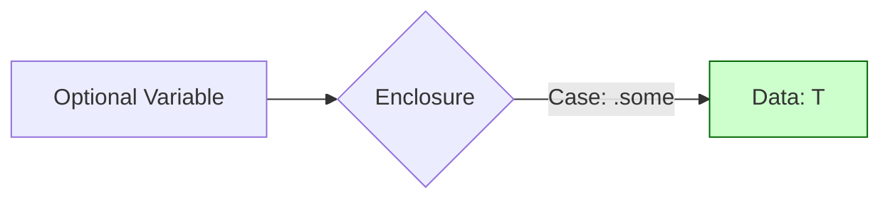

# `.some(Value)` (An Optional Containing a Value)

In the internal implementation of Swift's `Optional` type, the presence of a value is represented by the case `.some`. This case "wraps" or holds the underlying value of the generic type `T`.

## 1. Internal Definition
```swift
enum Optional<Wrapped> {
    case none
    case some(Wrapped)
}
```

## 2. Using `.some` explicitly
While we usually assign values directly (e.g., `let x: Int? = 5`), the compiler translates this to `.some(5)`. You can write it out explicitly if you need to be extremely clear or when working with nested optionals.

```swift
let name: String? = .some("antigravity")
```

## 3. The Power of "Wrapping"
Because the value is wrapped inside an enum case, it is shielded from accidental use. You can't perform string operations on a `String?` until you've extracted the `String` from the `.some` case.

## 4. Nested Opionals
One of the few times you'll see `.some` used explicitly is when dealing with an optional that contains an optional.

```swift
let doubleOptional: Int?? = .some(.some(5))
```

## 5. Pattern Matching with `.some`
You can use the `.some` keyword in `switch` statements to explicitly match successful cases.

```swift
switch someOptional {
case .some(let value):
    print("Found \(value)")
case .none:
    print("Found nothing")
}
```

## Diagram: The .some Box


> [!NOTE]
> `.some` is the constructive half of the Optional type. It represents the "Happy Path" where data is present and ready to be processed.
