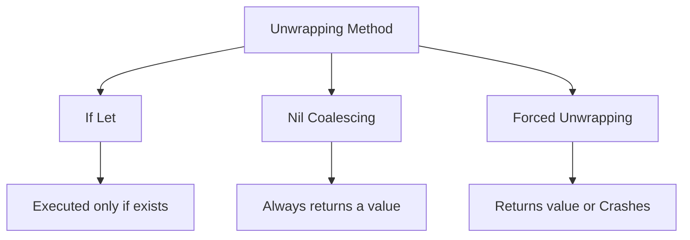

# Unwrapping Optionals

Because an Optional is a "wrapper" (an enum) around a possible value, you cannot use that value directly. You must first extract it from the optional—a process known as **Unwrapping**.

## 1. Safety Spectrum
There are several ways to unwrap a value, ranging from perfectly safe to highly dangerous.

### Safest: Optional Binding
Uses `if let` or `guard let` to verify the value exists and create a temporary non-optional copy.
```swift
if let val = optional { ... }
```

### Safe: Nil Coalescing
Provides a default value to use if the optional is `nil`.
```swift
let val = optional ?? "Default"
```

### Concise: Optional Chaining
Attempts to call a method or property. If the value is `nil`, the entire chain returns `nil`.
```swift
let val = optional?.count
```

### Dangerous: Forced Unwrapped
Directly accesses the value with `!`. Crashes if `nil`.
```swift
let val = optional! 
```

## 2. Why is Unwrapping Required?
Unwrapping is required to ensure **Type Safety**. If you have an `Int?`, you can't add it to another `Int` because the compiler doesn't know for sure that a number is inside. Unwrapping moves the value from the "possible" state to the "definite" state.

## 3. Logic Comparison


## 4. Performance
Safe unwrapping has negligible overhead. Most methods are compiled away into simple pointer checks.

> [!TIP]
> Always aim for "Safety First." Use `if let` or `??` unless you have a specific, documented reason to use forced unwrapping.
