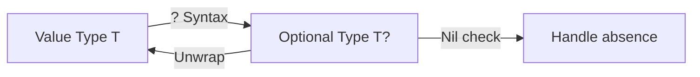

# What are Optionals?

In Swift, an **Optional** is a type that can hold either a value or `nil` to indicate that the value is missing.

## 1. The Core Definition
An optional is like a container. 
- Imagine a box that is labeled "Optional Integer".
- You can look in the box and find a number like `10`.
- Or you can look in the box and find that it is completely empty.

## 2. Type Safety
In many languages, any variable can be null. In Swift, variables are non-optional by default.

```swift
var name: String = "Alice"
// name = nil // ERROR: Cannot assign nil to non-optional type String
```

To allow a variable to be missing, you must explicitly declare it as an optional using the `?` character.

```swift
var possibleName: String? = "John"
possibleName = nil // VALID
```

## 3. The `Wrapped` Value
The actual value inside an optional is called the **Wrapped** value. Before you can use this value (e.g., to perform math or print it), you must "unwrap" it to make sure it exists.

## 4. Why Use Them?
- **Crash Prevention**: They force you to think about what happens when data is missing.
- **Consistency**: All types (Int, String, Structs, Classes) use the same optional system.
- **Clarity**: The code clearly documents which properties are required and which are optional.

## 5. Visual Summary


> [!TIP]
> Think of Optionals as a **contract** between the programmer and the compiler. The compiler promises to stop you from making mistakes with missing data, as long as you promise to use the `?` syntax correctly.
