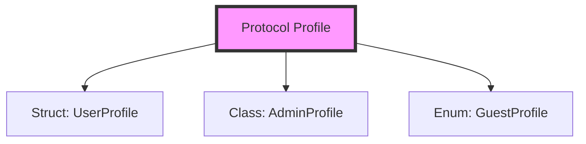

# Protocols in Swift

**Protocols** define a blueprint of methods, properties, and other requirements that suit a particular task or piece of functionality. The protocol can then be **adopted** by a class, structure, or enumeration to provide an actual implementation of those requirements.

## 1. What is a Protocol?
Think of a protocol as a "contract." If a type says it "conforms" to a protocol, it is promising the compiler that it implements everything the protocol requires.

```swift
protocol Identifiable {
    var id: String { get }
}

struct User: Identifiable {
    var id: String
    var name: String
}
```

## 2. Why Use Protocols?
- **Abstraction**: You can write code that works with *any* type that conforms to a protocol, without knowing the specific type.
- **Polymorphism**: Different types can be treated the same way if they share a protocol.
- **Protocol-Oriented Programming (POP)**: A core paradigm of Swift where functionality is shared via protocols and extensions rather than deep class hierarchies.

## 3. Key Concepts in this Section

### Requirements
- **Properties**: Specifying `{ get }` or `{ get set }`.
- **Methods**: Defining signatures that must be implemented.
- **Initializers**: Requiring specific `init` methods.

### Conformance
- **Extensions**: Adding behavior to existing types.
- **Multiple Protocols**: Adopting many "contracts" at once.
- **Synthesized Conformance**: Automatic implementation for `Equatable`, `Hashable`, and `Codable`.

### Advanced Features
- **Delegation**: A pattern for communication between objects.
- **Associated Types**: Generics for protocols.
- **Protocol Extensions**: Providing default implementations of logic.

## 4. Protocol Hierarchy


> [!IMPORTANT]
> Protocols are the primary way to share functionality in Swift. Unlike base classes (inheritance), a type can conform to as many protocols as it needs.
