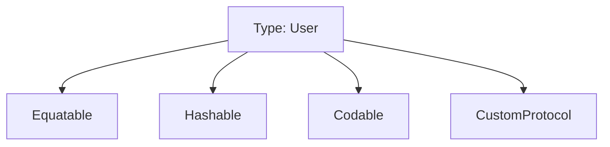

# Adopting Multiple Protocols

Unlike classes which can only have one superclass (single inheritance), a Swift type can adopt and conform to as many protocols as it needs.

## 1. Syntax
List the protocols separated by commas after the type name or superclass.

```swift
struct SmartPhone: Connectable, Chargeable, Playable {
    // Must implement requirements for all three protocols
}
```

## 2. Shared Requirements
If two protocols have a requirement with the same name and signature, a single implementation in the conforming type satisfies both.

```swift
protocol Named { var name: String { get } }
protocol Branded { var name: String { get } }

struct Shoe: Named, Branded {
    let name: String // Satisfies both!
}
```

## 3. Protocol Composition
When you need a variable to hold an object that conforms to multiple protocols, use the `&` operator.

```swift
func syncDevice(device: Connectable & Chargeable) {
    device.connect()
    device.charge()
}
```

## 4. Best Practice: Modular Protocols
Avoid creating "god protocols" that require everything. Instead, create small, focused protocols and combine them when needed.

- **Bad**: `protocol AllUIThings { ... }` (10 methods)
- **Good**: `protocol Draggable { ... }`, `protocol Zoomable { ... }`

## 5. Practical Example
```swift
class UserSession: Codable, Equatable, Hashable {
    // Codable: Local persistence
    // Equatable: Set/Array comparisons
    // Hashable: Use as Dictionary key
}
```

## Visualization


> [!TIP]
> If you find yourself frequently using the same combination of protocols (e.g., `ProtocolA & ProtocolB`), you can create a typealias for them:
> `typealias UIComponent = Viewable & Touchable`
