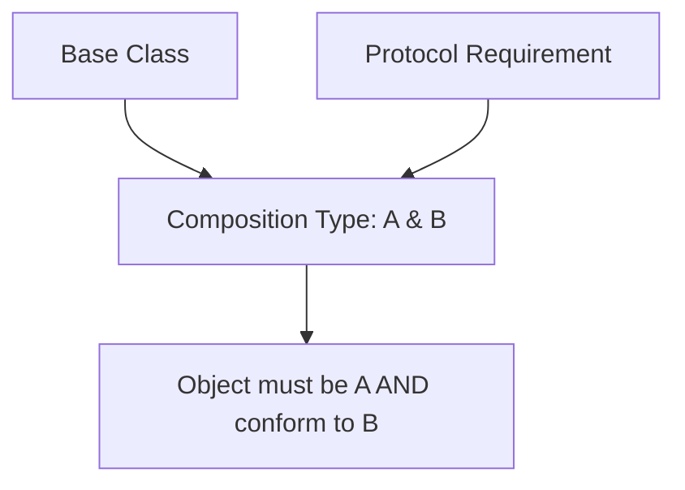

# Combining Protocols with Classes (`ClassA & ProtocolB`)

In Swift, you can create a type that represents an object that is an instance of a specific class **and** conforms to a specific protocol.

## 1. Syntax: Protocol Composition
Use the ampersand `&` to combine a class type with one or more protocol types.

```swift
class BaseCell: UITableViewCell { }
protocol Highlightable { func highlight() }

func configure(cell: BaseCell & Highlightable) {
    cell.highlight() // From Protocol
    cell.backgroundColor = .red // From Class (UITableViewCell)
}
```

## 2. Typealias for Complex Compositions
If you use a specific combination frequently, give it a name to improve readability.

```swift
typealias ValidatedUserView = UIView & Validatable
```

## 3. Generic Constraints
The same logic applies to generic constraints, allowing you to narrow down exactly what kind of objects your generic function can handle.

```swift
func update<T: UIViewController & DataProvider>(controller: T) {
    controller.view.backgroundColor = .white // View from controller
    controller.loadData() // Requirement from protocol
}
```

## 4. Why use this?
- **Legacy Interoperability**: Mixing modern protocols with existing class hierarchies (like UIKit/AppKit).
- **Narrow API surface**: Ensuring a function has access to both the properties of a base class and the behavior of a protocol without requiring a specific messy subclass.

## 5. Logic Diagram


> [!NOTE]
> You can only include **one** class in a composition, but you can include as many protocols as you like. This is because Swift does not support multiple inheritance for classes.
