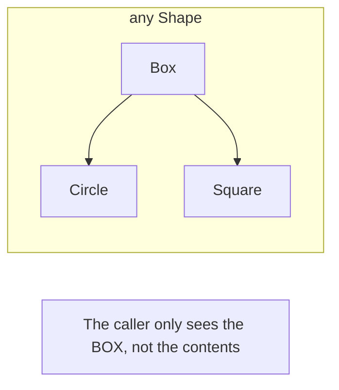

# Comparison with Existential Types (`any Protocol`)

Swift 5.7 introduced the `any` keyword to explicitly declare **Existential Types**. Understanding the difference between a protocol used as a constraint (Generics) and a protocol used as a type (`any`) is crucial for modern Swift development.

## 1. Existential Types (`any`)
When you use `any Protocol`, you are creating a "box" that can hold *any* type that conforms to the protocol. The specific type is hidden and only discovered at runtime.

```swift
var shape: any Shape = Circle()
shape = Square() // Valid, even though they are different types
```

## 2. Opaque Types (`some`)
When you use `some Protocol`, the specific type is fixed but hidden from the caller. It is determined at compile-time.

```swift
func getShape() -> some Shape { return Circle() }
```

## 3. Generics (`<T: Protocol>`)
Generics allow you to work with a specific, known type that conforms to a protocol. The compiler knows exactly what type it's dealing with.

## 4. Key Differences

| Feature | Generics (`T: P`) | Existential (`any P`) |
| :--- | :--- | :--- |
| **Dispatch** | Static (Fast) | Dynamic (Slow) |
| **Type Identity** | Preserved | Hidden (Eraused) |
| **Containers** | Homogeneous (All same) | Heterogeneous (Can mix) |
| **Associated Types** | Easy to work with | Complex (since Swift 5.7) |

## 5. When to Use Which?
- **Use Generics** by default for performance and type safety.
- **Use `any`** when you genuinely need to store a collection of different types together (e.g., `[any Shape]`).
- **Use `some`** for API boundaries where you want to hide implementation details but maintain type identity (e.g., SwiftUI views).

## Visualizing "Erasure"


> [!IMPORTANT]
> Since Swift 5.6+, the compiler will encourage you to use the `any` keyword when using a protocol as a type. This makes it explicit that you are opting into the overhead of an existential type.
