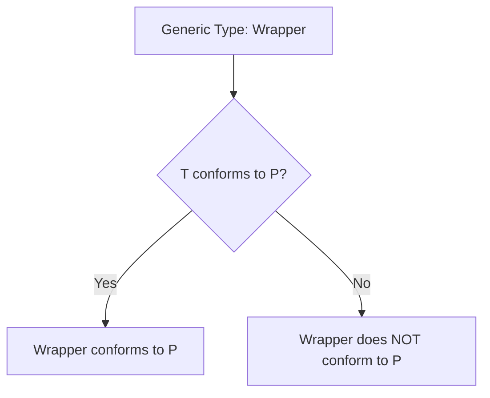

# Conditional Conformance

**Conditional Conformance** allows a generic type to conform to a protocol only when its type arguments meet certain requirements. This makes generics much more powerful and expressive.

## 1. The Core Example: `Array`
An array can only be compared if its elements can be compared.

```swift
extension Array: Equatable where Element: Equatable {
    // The compiler automatically synthesizes == for the array 
    // because it knows how to compare the elements.
}
```

## 2. Manual Implementation
You use the `where` clause in an extension to specify the conditions.

```swift
protocol TextRepresentable {
    var textDescription: String { get }
}

extension Array: TextRepresentable where Element: TextRepresentable {
    var textDescription: String {
        let items = self.map { $0.textDescription }
        return "List: " + items.joined(separator: ", ")
    }
}
```

## 3. Benefits
- **Expressivity**: You don't have to define specialized types (e.g., `EquatbleArray`).
- **Code Reuse**: One extension adds behavior to an infinite number of specific generic combinations.
- **Composition**: Behaviors "propagate" up the stack (if `T` is `Equatable`, `[T]` is `Equatable`, so `[[T]]` is also `Equatable`).

## 4. Common Use Cases
- **Collections**: Making `Array`, `Set`, and `Dictionary` conform to `Hashable`, `Equatable`, or `Codable`.
- **Combine**: Making publishers conform to certain protocols only if their `Output` does.
- **SwiftUI**: Views conforming to protocols based on their data.

## 5. Logic Flow


> [!IMPORTANT]
> Conditional conformance is determined at compile-time. If you have an `Array<Any>`, it will never conform to `Equatable` because `Any` does not conform to `Equatable`.
