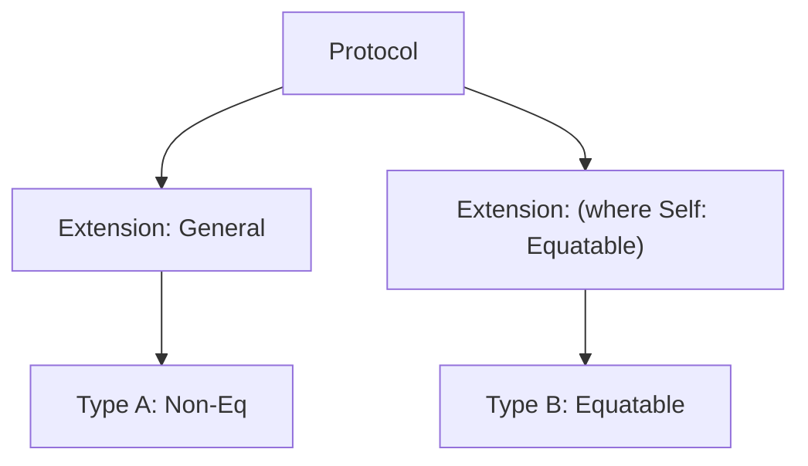

# Constraining Protocol Extensions (`where` clause)

When you extend a protocol to provide a default implementation, you can use a `where` clause to limit that implementation to only those types that meet specific criteria.

## 1. Syntax
Add a `where` clause after the protocol adoption in the extension.

```swift
protocol Collection { ... }

extension Collection where Element: Equatable {
    func allItemsMatch(_ item: Element) -> Bool {
        return self.allSatisfy { $0 == item }
    }
}
```

## 2. Benefits: Specialized Behavior
This allows you to provide powerful, specialized logic for specific subsets of types without cluttering the base protocol with requirements that only apply to some types.

## 3. Multiple Constraints
You can combine multiple constraints using commas.

```swift
extension MyProtocol where Self: UIView, Self: Loggable {
    func doSomething() {
        self.log("Action on view: \(self.frame)")
    }
}
```

## 4. Comparing Types
You can also constrain by specific types using the `==` operator.

```swift
extension Array where Element == String {
    func joinedWithHyphens() -> String {
        return self.joined(separator: "-")
    }
}
```

## 5. Use Case: Default Architectures
Common in patterns like **Coordinator** or **ViewModel**, where you provide default navigation or data loading logic only if the view controller meets certain interface requirements.



> [!TIP]
> Use constrained extensions to build "layered" functionality. Provide a basic default for everyone, and optimized or more capable versions for those types that have extra capabilities (like being `Comparable` or `Codable`).
