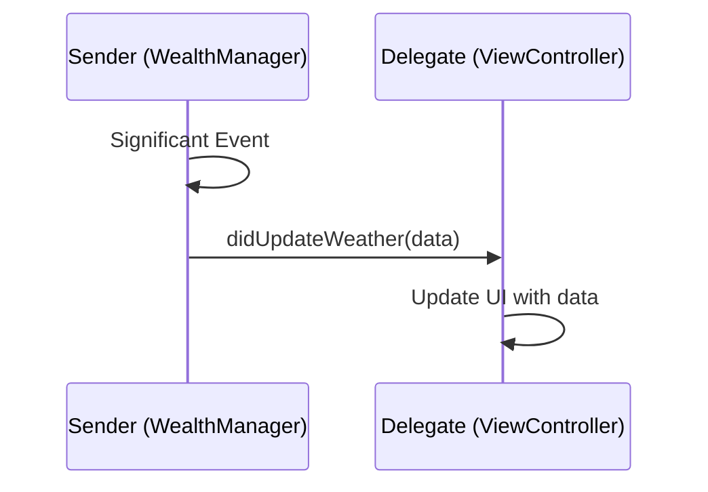

# Defining a Delegate Protocol

Delegation is a design pattern that enables a class or structure to hand off (or delegate) some of its responsibilities to an instance of another type.

## 1. Protocol Definition
A delegate protocol typically follows a specific naming convention: `[SenderName]Delegate`.

```swift
protocol WeatherManagerDelegate: AnyObject {
    func didUpdateWeather(_ weather: WeatherModel)
    func didFailWithError(_ error: Error)
}
```

## 2. Requirements for Delegates
- **Class-Only**: Use `AnyObject` so the delegate can be held as a `weak` reference safely.
- **Naming**: Methods usually start with the sender's name and include words like `did`, `will`, or `should`.
- **Primary Argument**: The first argument of every delegate method should be the object sending the message (the "delegator").

```swift
func weatherManager(_ manager: WeatherManager, didUpdateWeather weather: WeatherModel)
```

## 3. Why Include the Sender?
Including the sender (e.g., `_ manager: WeatherManager`) allows a single delegate to manage multiple instances of the same class (e.g., one controller managing three different download managers).

## 4. Logical Interaction


## 5. Summary
A well-defined delegate protocol provides a clean, type-safe interface for two objects to communicate without being tightly coupled.

> [!TIP]
> Always mark your delegate protocols as `AnyObject`. This is a prerequisite for preventing memory leaks (retain cycles) when implemented in your classes.
