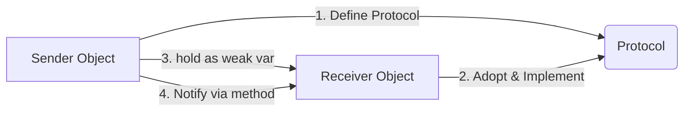

# Delegation Pattern

**Delegation** is a fundamental design pattern in Apple's frameworks (UIKit, AppKit, etc.). It allows one object to coordinate with another in a loosely coupled way.

## 1. How it Works
1. **Object A (The Sender)** defines a protocol describing what it needs help with.
2. **Object A** has a property (usually called `delegate`) that holds any object conforming to that protocol.
3. **Object B (The Receiver)** conforms to the protocol and implements its methods.
4. **Object A** calls its `delegate`'s methods when something important happens.

## 2. Structural Example
```swift
class DownloadManager {
    weak var delegate: DownloadManagerDelegate?
    
    func finish() {
        delegate?.downloadDidFinish()
    }
}

class Dashboard: DownloadManagerDelegate {
    func downloadDidFinish() {
        print("Refreshing dashboard data...")
    }
}
```

## 3. Core Principles
- **Loose Coupling**: `DownloadManager` doesn't need to know that `Dashboard` exists. It only knows that *something* conforming to the protocol exists.
- **One-to-One**: Delegation typically represents a one-to-one relationship (one sender, one receiver).
- **Control Flow**: The sender stays in control of the logic; the delegate just provides customization or notifications.

## 4. Visual Flow


## 5. Comparison: Delegation vs Notifications
- **Delegation**: One-to-one, synchronous feedback, strictly typed.
- **NotificationCenter**: One-to-many, broadcast-only, decoupled.

> [!CAUTION]
> Always use `weak` for the delegate property to prevent memory leaks. If Object A owns Object B, and Object B is Object A's delegate, they will keep each other alive forever (Retain Cycle) unless one reference is weak.
