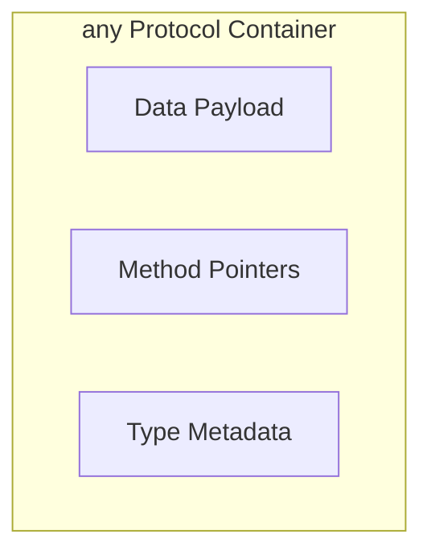

# Existential Types (`any Protocol`)

**Existential types** allow you to work with values purely through the interface of a protocol. It is called an "existential" because it represents a value that *exists* and conforms to the protocol, but its specific type is unknown.

## 1. The `any` Keyword
Since Swift 5.7, you must use the `any` keyword when declaring a variable that can hold any conforming type.

```swift
protocol Animal { func makeNoise() }

var pet: any Animal = Cat()
pet = Dog() // Valid, even if Dog is a different size/type than Cat
```

## 2. Internal Mechanism: Existential Containers
When you store a value in `any Animal`, Swift puts it in a "box" called an existential container. This container handles:
- **Value Buffer**: Storing the actual data (up to 3 words on the stack, the rest on the heap).
- **VWT (Value Witness Table)**: Information on how to copy/destroy the type.
- **PWT (Protocol Witness Table)**: Pointers to the specific implementation of the protocol methods.

## 3. Runtime Polymorphism
Because the specific type is hidden and looked up at runtime, `any` allows for heterogeneous collections.

```swift
let pets: [any Animal] = [Cat(), Dog(), Bird()]
for p in pets { p.makeNoise() }
```

## 4. Performance Implications
Using `any` has a cost:
- **Dynamic Dispatch**: Methods are looked up at runtime.
- **Memory**: Potential heap allocation for large structs.
- **Optimizations**: Harder for the compiler to inline code.

## 5. `any` vs `some` (Opaque Types)
- **`any`**: Can change over time (multiple conforming types). High flexibility.
- **`some`**: Fixed to one specific type at compile-time. High performance.

## Logic Visualization


> [!IMPORTANT]
> Use `any Protocol` only when you need the flexibility of storing different types in the same variable or array. If you know you will always use the same type in a scope, use **Generics** instead.
