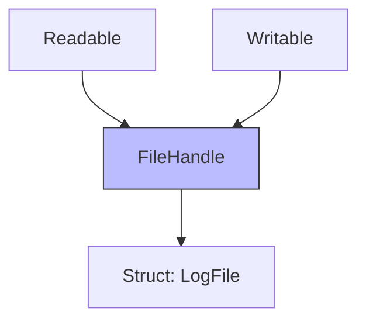

# Inheriting from Multiple Protocols

Just as classes can inherit from other classes, protocols can inherit from one or more other protocols. This allows you to build complex interfaces from simple, reusable blueprints.

## 1. Basic Inheritance
A protocol inherits from another by listing it after a colon.

```swift
protocol Readable { func read() }
protocol Writable { func write() }

// Inherits from both
protocol FileHandle: Readable, Writable {
    func sync()
}
```

## 2. Conformance Impact
If a type adopts `FileHandle`, it is now required to implement:
1. `read()` (from Readable)
2. `write()` (from Writable)
3. `sync()` (from FileHandle)

## 3. Specialization
Protocol inheritance is often used to add specialized behavior to a general interface.

```swift
protocol Collection { ... }
protocol MutableCollection: Collection { ... }
protocol RangeReplaceableCollection: MutableCollection { ... }
```

## 4. Class-Only Inheritance
If a parent protocol is marked `AnyObject`, all child protocols automatically become class-only as well.

```swift
protocol Parent: AnyObject {}
protocol Child: Parent {} // Child is automatically class-only
```

## 5. Hierarchy Visualization


## Use Case: Feature Layers
Inheritance and composition are great for building layers of functionality:
- **Base Layer**: `Identifiable`
- **Logic Layer**: `NetworkSyncable: Identifiable`
- **UI Layer**: `Displayable: Identifiable`

> [!TIP]
> Use inheritance when there is a strong "is-a" relationship between requirements. Use composition (`&`) when you just need to combine two independent capabilities for a specific task.
