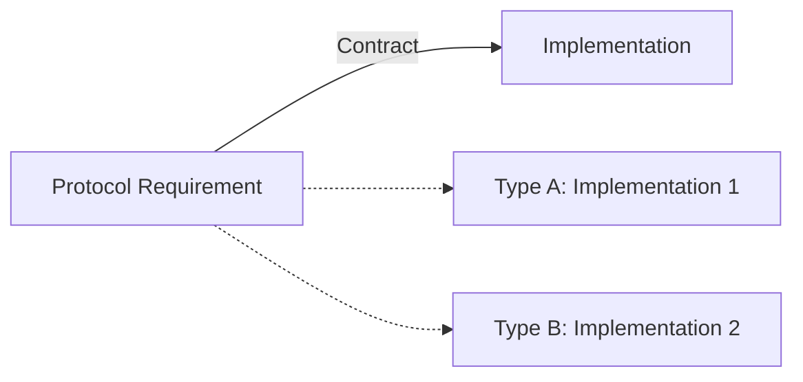

# Instance Methods in Protocols

Protocols can specify instance methods that conforming types must implement. These methods can define the "verbs" or behaviors of the conforming type.

## 1. Method Requirements
A protocol defines the method name, parameters, and return type. It cannot contain any logic.

```swift
protocol Operatable {
    func performAction() -> Bool
    func update(with value: Int)
}
```

## 2. Parameter Labels
The parameter labels in the conforming type must match the labels defined in the protocol exactly.

```swift
struct Tool: Operatable {
    func performAction() -> Bool { return true }
    func update(with value: Int) { ... }
}
```

## 3. Default Arguments
Protocols **cannot** define default values for parameters.

```swift
// ERROR
protocol Broken {
    func test(val: Int = 0) 
}
```
*Workaround: Provide the default value in a protocol extension.*

## 4. Variability
Conforming types can add their own methods, but they must at least provide what the protocol asks for.

## 5. Logic Flow


> [!TIP]
> Use instance methods in protocols to define transitions or transformations (e.g., `save()`, `refresh()`, `toggle()`). This allows you to treat a group of different objects as "things that can be refreshed."
